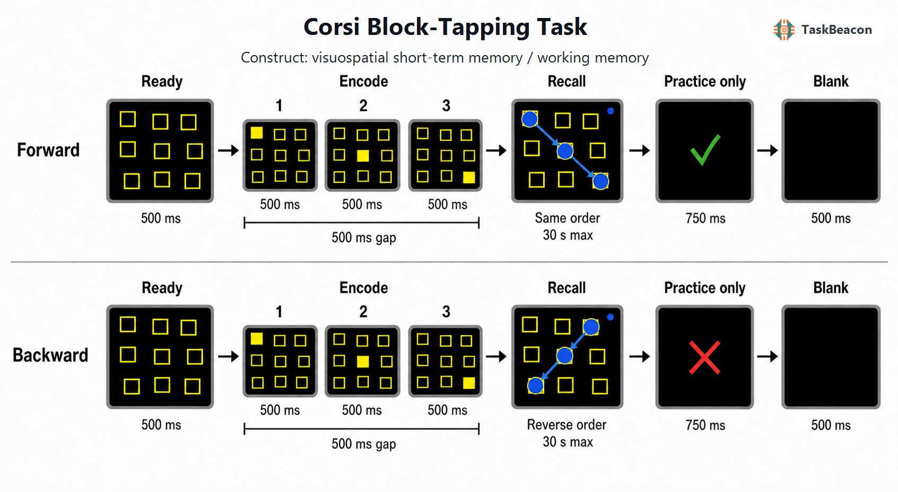

# Corsi 方块敲击任务：视空间序列记忆的实验逻辑、神经机制与测量边界

视空间短时记忆研究需要同时控制位置集合、序列长度与输出顺序，才能区分有限容量、序列组织和执行操作对成绩的贡献。Corsi 方块敲击任务（Corsi Block-Tapping Task, CBTT）以不规则空间中的位置序列为记忆材料，通过逐级增加序列长度估计视空间广度。该范式结构简洁，已成为神经心理评估与实验研究中常用的非言语记忆测量，但“Corsi 跨度”并非脱离程序参数而恒定的能力指标：方块布局、呈现速率、试次数量、停止规则、正序或倒序回忆以及实体、触屏或鼠标界面都会改变任务要求（Berch et al., 1998; Arce & McMullen, 2021）。因此，对结果的有效解释必须把心理构念绑定到具体版本、任务阶段与计分方法。

## 1. 范式提出与理论背景

该任务源于蒙特利尔神经学研究所对颞叶切除患者材料特异性记忆的研究。Milner（1971）报告了言语与非言语序列记忆的半球差异；Corsi（1972）在博士论文中系统描述了由九个不规则排列方块构成的非言语序列任务。早期设计借鉴 Hebb 数字序列范式，以空间位置序列替代口头数字，考察内侧颞叶损伤与非言语学习、短时保持之间的关系。后续综述指出，临床与实验研究长期使用了不同的板面尺寸、敲击速率、序列生成方式和计分规则，因而历史名称相同并不保证测量等价（Berch et al., 1998）。

标准化工作将经典程序明确为九个固定、不规则排列的方块，由主试按约每秒一个位置呈现序列，受试者随后按相同顺序复现；序列从较短长度开始递增，在同一长度连续失败后停止，最长成功序列构成跨度分数。Kessels 等（2000）提供了统一施测与计分方法，并在健康成人和脑损伤患者中建立参照数据，右半球损伤组的表现低于左半球损伤组。这一结果支持任务对视空间短时保持的敏感性，但病灶组差异不能单独确定某个脑区对正常表现的充分或必要作用。

工作记忆理论通常将正序 Corsi 与位置—顺序信息的短时保持相联系，将倒序条件视为增加了序列重排和执行控制要求。该区分具有经验依据，但不宜简单套用数字广度的正倒序解释。空间路径可以被编码为整体构形或相邻位置之间的运动轨迹，倒序复现仍可能利用同一构形；正序和倒序难度差异也会随空间能力、路径形状及呈现格式而变化（Berch et al., 1998; Cornoldi & Mammarella, 2008）。因而，倒序减去正序并不是纯粹的“中央执行功能”指标，而是保持、顺序转换、起点检索和反应规划的复合对比。

## 2. 任务逻辑、流程与核心参数

典型试次包含编码与回忆两个主要阶段。编码阶段中，九个位置保持固定，主试敲击或屏幕逐个点亮其中若干位置；序列长度定义记忆负荷，单项呈现时间与相邻项目起始间隔共同决定编码机会。回忆阶段在序列结束后立即开始，受试者按原顺序或反向顺序敲击、触摸或点击位置。完全匹配目标序列通常记为正确，遗漏、错位或顺序错误均记为失败。主要因变量包括最长成功跨度、正确序列总数或乘积型总分；计算机版本还可记录首击潜伏期、完成时间与逐次选择时间。

自适应跨度程序以正确与否控制下一试次的序列长度：达到当前长度的进阶标准后增加一个位置，在规定次数内未达到标准则终止。该方法减少明显超出个体能力的试次，但跨度是离散的停止规则产物；每个长度的尝试次数、进阶阈值和最大长度均会影响分数分布。固定负荷设计则让所有参与者完成相同长度，便于估计负荷效应和神经信号，却可能在低负荷产生天花板、在高负荷产生地板效应。两类设计回答的问题不同，不应直接合并其正确率或神经对比。

正序条件的核心对比通常是长序列与短序列，支持对容量负荷的判断；倒序条件相对正序的差异还包含顺序转换和输出规划。编码期活动不能与回忆期操作混同，实体版本中的主试动作观察也会提供方向、速度和生物运动线索。触屏保留直接指向关系，鼠标版本则增加屏幕—控制器映射和光标控制。数字化提高了刺激定时、序列复现和逐次反应记录的一致性，但界面改变本身属于实验操作，而非单纯的呈现载体（Brunetti et al., 2014; Arce & McMullen, 2021）。

## 3. 主要行为与神经科学发现

### 3.1 行为表现与构念分化

人群研究较一致地表明，Corsi 跨度随年龄和教育经历变化，解释个体分数时需要相应常模。成人正序、倒序跨度的标准化资料显示两者相关但不等同，倒序成绩在区分高、低空间能力群体时可提供正序之外的信息（Cornoldi & Mammarella, 2008; Monaco et al., 2013）。更新的回归常模在 20—89 岁成人中进一步显示，年龄与教育均预测 Corsi 跨度，而性别在该样本中未进入最佳校正模型（Facchin et al., 2024）。这些关系支持发展与老化研究中的应用，也说明未经人口学校正的单一截点不适合跨年龄、跨教育样本直接比较。

数字版本的群体效度已有一定支持。eCorsi 通过触摸界面控制呈现时间与反应记录，在成人样本中获得了与传统版本相近的表现模式（Brunetti et al., 2014）。精神病性障碍患者与健康对照的比较中，传统和触屏版本均区分了两组，但二者与一般智力及言语工作记忆的相关模式并不完全一致（Siddi et al., 2020）。这表明已知组效度不能自动证明版本可互换，尤其不能把数字版本的分数直接代入实体版本常模。

训练研究也限定了构念解释。健康青年在一次 20 分钟计算机化 Corsi 训练后，心理旋转正确试次反应时相对对照组改善，但研究采用非随机分组且仅检验即时迁移（Schaefer et al., 2022）。在卒中成人中采用相近时长的训练并未改善心理旋转（Kettlety et al., 2025）。两项结果共同说明，Corsi 练习产生的近迁移或远迁移取决于样本、剂量和结局指标，现有证据不足以把单次训练效果解释为一般视空间能力的稳定提升。

### 3.2 血流动力学与电生理证据

任务特异性神经影像证据支持分布式空间序列编码，而非单一脑区对应单一“跨度模块”。在改编的计算机化 Corsi 编码任务中，变化位置序列相对于固定位置基线引起右侧海马以及额顶区域更强的血氧水平依赖信号（Toepper et al., 2010）。该对比同时改变空间位置变化、序列组织和负荷，因而支持内侧颞叶与额顶网络参与空间序列编码，却不能单独证明海马活动是跨度差异的原因。

功能性近红外光谱（functional near-infrared spectroscopy, fNIRS）研究提供了更接近日常施测环境的证据。计算机化标准 Corsi 与加入方块抑制要求的版本均涉及前额叶血流动力学变化，但腹外侧与背外侧前额叶未呈现清晰的任务特异性分离（Lancia et al., 2018）。实体施测的主试—受试者双人研究发现，双方前额叶反应随负荷呈相近变化，主试还表现出更强的左侧活动，提示实体版本同时包含动作观察、轮替与主试自身序列保持（Panico et al., 2021）。这些成分在自动化版本中被削弱，跨版本比较神经信号时必须将社会互动和运动线索列为替代解释。

脑电图（electroencephalography, EEG）证据目前较少，但近期研究直接比较了实体与数字 Corsi。4 岁、6 岁儿童在实体版本表现更好，成人两版本行为相近但数字版本出现更高的相对 theta 功率；跨版本而言，更好成绩与较低 theta、较高 alpha 和 beta 功率相关（Zhang et al., 2026）。该结果表明数字化可能改变神经加工需求，头皮频段功率也不足以定位具体皮层来源。其价值主要在于揭示版本效应的时间与频谱特征，而非为数字—实体等价提供无条件支持。

## 4. 范式发展与主要应用

Corsi 范式的发展主要沿标准化、数字化和空间尺度扩展三条方向展开。标准化使跨度可用于脑损伤、精神病性障碍、发育和老化样本的组间比较；数字化提高了刺激定时与原始反应记录的可重复性；步行版和虚拟现实版则把桌面位置记忆扩展到身体尺度空间。近期虚拟现实复制研究发现，实体与虚拟现实版本的组均值相近，但个体层面并不充分一致，年龄、晕动不适和情绪体验可能贡献版本差异（Zsebi et al., 2025）。因此，新载体能够拓展研究问题，却需要独立验证，不能因保留“九方块—序列复现”外形便继承原版常模。

临床上，Corsi 适合描述视空间短时记忆或工作记忆的相对薄弱，并可与言语广度、视觉模式记忆、执行任务及日常空间功能形成测验组合。Kessels 等（2000）的病灶资料和 Siddi 等（2020）的精神病性障碍研究均支持群体敏感性。单项低分仍可能由视觉搜索、运动控制、指令理解、注意波动或策略差异造成；在缺乏匹配常模、重复测量和其他认知指标时，Corsi 结果不能独立确定病因或个体诊断。

## 5. 测量效度与解释边界

Corsi 任务的内容效度来自对位置与顺序的直接操作，但构念效度受路径构形和输出方式影响。参与者可采用逐点顺序、整体形状、言语标签或运动轨迹策略，同一跨度分数可能由不同表征获得。倒序条件增加操作要求，却未隔离纯执行成分；首击潜伏期和完成时间也混合了检索、运动规划与设备操作。研究设计应报告方块坐标或布局来源、序列集合、重复位置规则、呈现时序、反应设备、进阶和停止规则，以及采用跨度还是总正确数作为主要结局（Berch et al., 1998; Arce & McMullen, 2021）。

可靠性问题同样依赖测量层级。稳定的组均值差异不保证个体排序具有足够重测信度，少量二分试次生成的最长跨度容易受单次失误影响。练习、主动干扰、序列难度不均和天花板效应还会改变重复测量。数字化减少主试节律误差，但不能消除序列抽样误差，也不能自动获得与传统常模相同的解释。实体、触屏、鼠标和虚拟现实版本应分别验证测量一致性；纵向研究宜保留等难平行序列并预先规定主要计分指标。

神经结果需保持空间、时间与因果边界。fMRI 的额顶和海马活动是条件相关的血流差异，不能证明某一区域对成绩具有因果作用；fNIRS 主要覆盖表层皮层且空间分辨率有限；EEG 频段功率提供时间信息，但源定位需额外模型。跨研究异质性可能来自编码与回忆是否分离、负荷是否固定、基线是否控制视觉和运动成分，以及实体主试互动是否存在。由此，Corsi 最适合作为操作明确的空间序列记忆指标，并与其他任务、人口学常模和过程数据联合解释。

## 6. TaskBeacon 中的任务实现

### 6.1 任务资源与访问入口

| 资源 | ID | 用途 | 地址 |
|---|---|---|---|
| TaskBeacon 完整研究实现 | T000060 | PsychoPy/PsyFlow 行为实验源码 | [GitHub 仓库](https://github.com/TaskBeacon/T000060-corsi-block-tapping-task) |
| 浏览器伴随实现 | H000060 | 与 T 版核心流程对齐的网页行为任务源码 | [GitHub 仓库](https://github.com/TaskBeacon/H000060-corsi-block-tapping-task) |
| 在线运行入口 | H000060 | 无需本地实验环境的浏览器体验与行为采集 | [运行任务](https://taskbeacon.github.io/psyflow-web/?task=H000060-corsi-block-tapping-task) |

TaskBeacon 当前版本为中文行为实验，采用九个固定不规则位置的黄色方块轮廓。人类运行时，正序与倒序区块依据受试者编号进行确定性平衡；每个方向先完成 3 个长度为 3 的练习试次，再从长度 2 开始正式测量。每一长度提供两次机会，至少一次完全正确则进阶，两个试次均失败则结束该方向，最大长度为 9。两方向均达到最大负荷时最多执行 38 个试次，其中 6 个为练习。H000060 保留相同布局、时序、正倒序规则和自适应逻辑，是浏览器行为伴随实现；它不应被视为带有额外神经或临床采集硬件的版本。

**图 1. TaskBeacon 当前版本的单试次流程。** 九个方块先以静息轮廓呈现 500 ms，随后目标方块逐个填充黄色，每项呈现 500 ms，相邻闪现之间为空板 500 ms，形成 1,000 ms 的闪现起始间隔。蓝色准备标记随最后一次闪现出现，并在回忆阶段保留；指针输入仅在最后一次闪现结束后开放。正序条件要求按呈现顺序选择，倒序条件要求按相反顺序选择，回忆限时 30 s，选择数达到序列长度后以与目标序列完全一致为正确。仅练习试次呈现 750 ms 正误反馈，之后进入 500 ms 空屏间隔。正式测量从长度 2 至 9，每长度两次，至少一次正确进阶，两次均错误终止；跨度记为成功复现的最长序列。

该实现记录呈现序列、目标序列、逐次选择及时间戳、首击潜伏期、完成潜伏期、正确性、超时状态和自适应状态。序列在单个试次内不重复位置，并由独立固定种子预先生成，有利于复现和过程分析。跨度仍受当前“两次机会、一次正确进阶”的规则约束；与采用三次机会、不同停止标准或专有常模的临床版本比较时，应报告本实现参数，而不直接套用其截点。

## 参考文献

Arce, T., & McMullen, K. (2021). The Corsi Block-Tapping Test: Evaluating methodological practices with an eye towards modern digital frameworks. *Computers in Human Behavior Reports, 4*, 100099. https://doi.org/10.1016/j.chbr.2021.100099

Berch, D. B., Krikorian, R., & Huha, E. M. (1998). The Corsi block-tapping task: Methodological and theoretical considerations. *Brain and Cognition, 38*(3), 317–338. https://doi.org/10.1006/brcg.1998.1039

Brunetti, R., Del Gatto, C., & Delogu, F. (2014). eCorsi: Implementation and testing of the Corsi block-tapping task for digital tablets. *Frontiers in Psychology, 5*, 939. https://doi.org/10.3389/fpsyg.2014.00939

Cornoldi, C., & Mammarella, I. C. (2008). A comparison of backward and forward spatial spans. *Quarterly Journal of Experimental Psychology, 61*(5), 674–682. https://doi.org/10.1080/17470210701774200

Corsi, P. M. (1972). *Human memory and the medial temporal region of the brain* [Doctoral dissertation, McGill University]. Library and Archives Canada. https://library-archives.canada.ca/eng/services/services-libraries/theses/Pages/item.aspx?idNumber=1033436511

Facchin, A., Pegoraro, S., Rigoli, M., Rizzi, E., Strina, V., Barera, S., Castiglieri, G., Daini, R., & Guarnerio, C. (2024). Regression-based normative data for Corsi Span and Supraspan learning and recall among Italian adults. *Neurological Sciences, 45*(12), 5707–5718. https://doi.org/10.1007/s10072-024-07756-6

Kessels, R. P. C., van Zandvoort, M. J. E., Postma, A., Kappelle, L. J., & de Haan, E. H. F. (2000). The Corsi Block-Tapping Task: Standardization and normative data. *Applied Neuropsychology, 7*(4), 252–258. https://doi.org/10.1207/S15324826AN0704_8

Kettlety, S. A., Kibler, G. L., Hooyman, A., Holl, C. K., Schaefer, S. Y., & Leech, K. A. (2025). Twenty minutes of Corsi block tapping task training does not improve mental rotation in adults with stroke. *Frontiers in Neurology, 16*, 1601454. https://doi.org/10.3389/fneur.2025.1601454

Lancia, S., Cofini, V., Carrieri, M., Ferrari, M., & Quaresima, V. (2018). Are ventrolateral and dorsolateral prefrontal cortices involved in the computerized Corsi block-tapping test execution? An fNIRS study. *Neurophotonics, 5*(1), 011019. https://doi.org/10.1117/1.NPh.5.1.011019

Milner, B. (1971). Interhemispheric differences in the localization of psychological processes in man. *British Medical Bulletin, 27*(3), 272–277. https://doi.org/10.1093/oxfordjournals.bmb.a070866

Monaco, M., Costa, A., Caltagirone, C., & Carlesimo, G. A. (2013). Forward and backward span for verbal and visuo-spatial data: Standardization and normative data from an Italian adult population. *Neurological Sciences, 34*(5), 749–754. https://doi.org/10.1007/s10072-012-1130-x

Panico, F., De Marco, S., Sagliano, L., D’Olimpio, F., Grossi, D., & Trojano, L. (2021). Brain hemodynamic response in Examiner–Examinee dyads during spatial short-term memory task: An fNIRS study. *Experimental Brain Research, 239*(5), 1607–1616. https://doi.org/10.1007/s00221-021-06073-0

Schaefer, S. Y., Hooyman, A., Haikalis, N. K., Essikpe, R., Lohse, K. R., Duff, K., & Wang, P. (2022). Efficacy of Corsi Block Tapping Task training for improving visuospatial skills: A non-randomized two-group study. *Experimental Brain Research, 240*(11), 3023–3032. https://doi.org/10.1007/s00221-022-06478-5

Siddi, S., Preti, A., Lara, E., Brébion, G., Vila, R., Iglesias, M., Cuevas-Esteban, J., López-Carrilero, R., Butjosa, A., & Haro, J. M. (2020). Comparison of the touch-screen and traditional versions of the Corsi block-tapping test in patients with psychosis and healthy controls. *BMC Psychiatry, 20*(1), 329. https://doi.org/10.1186/s12888-020-02716-8

Toepper, M., Markowitsch, H. J., Gebhardt, H., Beblo, T., Thomas, C., Gallhofer, B., Driessen, M., & Sammer, G. (2010). Hippocampal involvement in working memory encoding of changing locations: An fMRI study. *Brain Research, 1354*, 91–99. https://doi.org/10.1016/j.brainres.2010.07.065

Zhang, S., Grimes, B., Alam, A., Gluyas, A., Shatek, S. M., & Scerif, G. (2026). Behaviour and neural oscillations differentiate physical and digital versions of the Corsi block tapping task. *Neuropsychologia, 226*, 109437. https://doi.org/10.1016/j.neuropsychologia.2026.109437

Zsebi, S., Sik-Lanyi, C., Szabó, P., Filotás, P., Zsuffa, J. A., & Cserjési, R. (2025). A virtual reality take on the Corsi-Block Tapping Task: Exploring VR for spatial working memory assessment. *Acta Psychologica, 261*, 105918. https://doi.org/10.1016/j.actpsy.2025.105918
